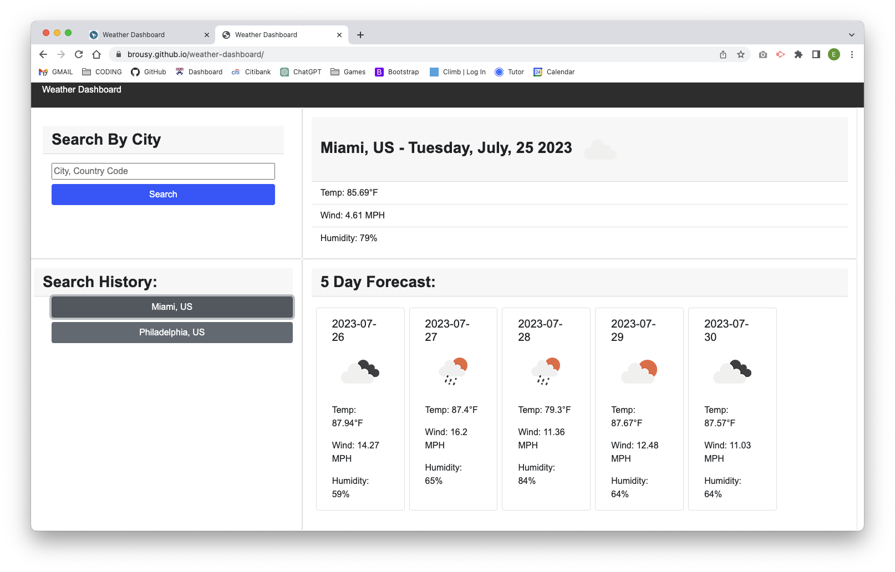

# weather-dashboard
## User Story

AS A traveler
I WANT to see the weather outlook for multiple cities
SO THAT I can plan a trip accordingly

## Acceptance Criteria

GIVEN a weather dashboard with form inputs
WHEN I search for a city
THEN I am presented with current and future conditions for that city and that city is added to the search history
WHEN I view current weather conditions for that city
THEN I am presented with the city name, the date, an icon representation of weather conditions, the temperature, the humidity, and the the wind speed
WHEN I view future weather conditions for that city
THEN I am presented with a 5-day forecast that displays the date, an icon representation of weather conditions, the temperature, the wind speed, and the humidity
WHEN I click on a city in the search history
THEN I am again presented with current and future conditions for that city

## Description

Provide a short description explaining the what, why, and how of your project. Use the following questions as a guide:

- What was your motivation?
To learn about implementing third party APIs, and using json to roll over data. 

- Why did you build this project? 
To build a weather dashboard that will run in the browser and feature dynaically updated HTML and CSS. 

- What problem does it solve?
Bare HTML document with all of the page created dynimically. 

- What did you learn?
 How to implement boot strap 

## Credits

Tutor, Sandta Smith

## License

The MIT License (MIT)

## Screen Shots
<!-- add screen shots to image folder -->

## Live Link to App

[https://brousy.github.io/weather-dashboard/]
